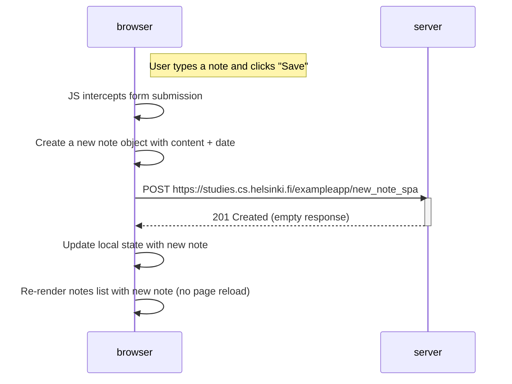

```mermaid
sequenceDiagram
    participant browser
    participant server

    Note right of browser: User types a note and clicks "Save"

    browser->>browser: JS intercepts form submission
    browser->>browser: Create a new note object with content + date
    browser->>server: POST https://studies.cs.helsinki.fi/exampleapp/new_note_spa
    activate server
    server-->>browser: 201 Created (empty response)
    deactivate server

    browser->>browser: Update local state with new note
    browser->>browser: Re-render notes list with new note (no page reload)
```

